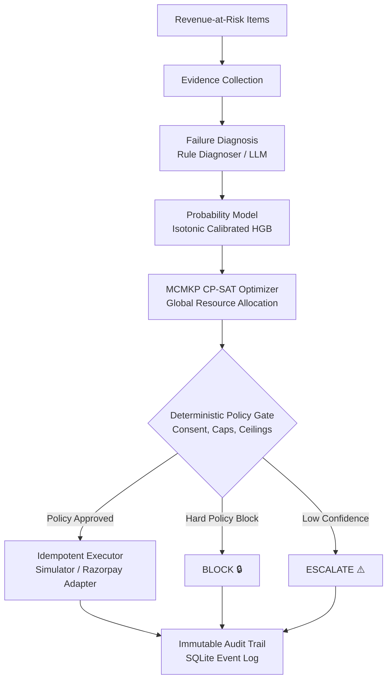
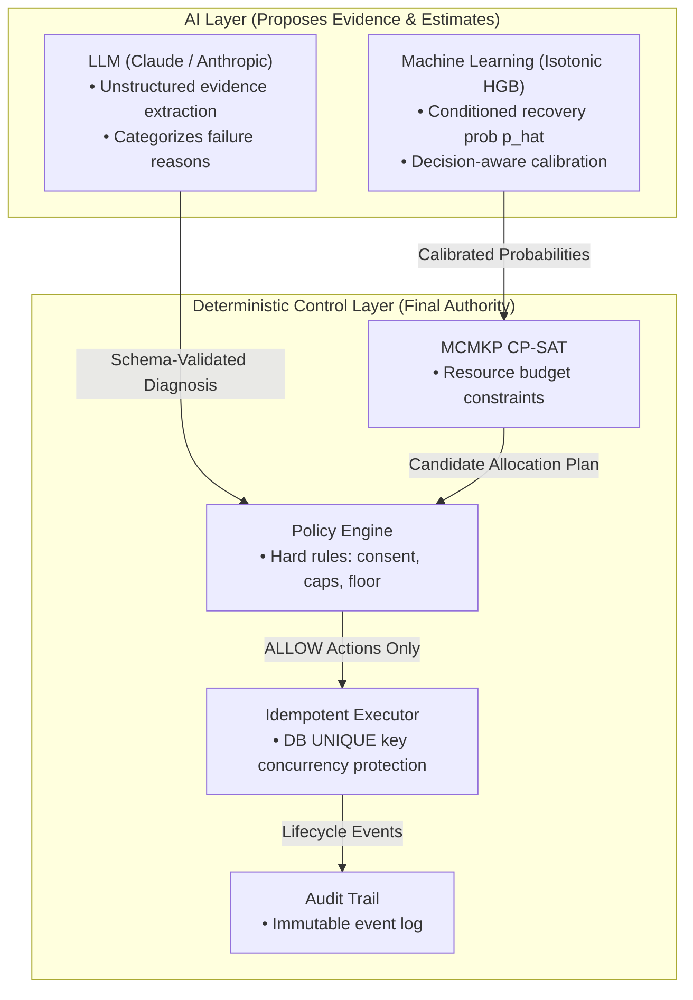

# RECOVER-ALLOC

> **Don't just retry failed payments. Allocate recovery capacity intelligently.**<br/>
> *An AI-assisted revenue recovery decision engine that chooses which accounts to recover, which intervention to use, and when to stop under scarce retry, messaging, and human-operation capacity.*

"RECOVER-ALLOC treats revenue recovery as a resource-allocation problem, not a retry problem."

---

| System Layer | Implementation Technology | Operational Role |
| :--- | :--- | :--- |
| **Optimization** | **Google OR-Tools CP-SAT** | Chooses the best feasible recovery portfolio |
| **Prediction** | **HistGradientBoosting + Isotonic Calibration** | Estimates intervention-conditioned recovery probability |
| **AI Diagnosis** | **Anthropic Claude (LLM)** | Extracts evidence from unstructured failure context |
| **Safety Gate** | **Deterministic Policy Engine** | Blocks actions that violate merchant or operational rules |
| **Execution** | **Idempotent State Machine** | Prevents duplicate internal execution claims |
| **Evaluation** | **Frozen 20-Seed Simulator Benchmark** | Measures economic performance on a frozen benchmark |

---

## RECOVER-ALLOC in 60 Seconds

- **The Core Bottleneck**: Merchant payment recovery is bounded by strict capacity limits—API retry rate limits, WhatsApp quotas, and manual human operations hours.
- **Why Naive Tools Fail**: Generic recovery tools rank accounts greedily by monetary value or raw probability. High-value accounts hog scarce multi-resource channels (like WhatsApp), starving accounts with zero alternative fallbacks.
- **The Engine**: RECOVER-ALLOC formulates recovery as a **Multi-Choice Multi-Dimensional Knapsack Problem (MCMKP)** solved via **Google OR-Tools CP-SAT**.
- **AI Authority Boundary**: AI proposes diagnostic evidence and probability estimates, but **deterministic policy and execution controls retain final authority over every dispatch**.
- **Safety First**: Database-backed idempotency blocks duplicate internal execution claims; external uncertainty is surfaced explicitly rather than retried blindly.


---

## The Problem & The Insight

Merchants experience payment failures, subscription churn, and unpaid B2B invoices daily. However, recovery capacity is subject to explicit operational boundaries:
- **Payment Retry API Limits**: Daily transaction attempt ceilings.
- **Messaging Quotas**: Bounded WhatsApp/SMS communication volumes.
- **Human Escalation Hours**: Strictly limited manual operations time.
- **Contact Frequency Caps**: Prevention of customer harassment.
- **Monetary Floor Limits**: Prevention of negative net recovery on low-value items.

> ### The Core Insight
> **"The recovery problem isn't 'Who is most likely to pay?'**<br/>
> **It's 'Where should limited recovery capacity be spent?'"**

When recovery resources are scarce, every intervention assigned to Account A creates an **opportunity cost** for Account B. Optimization must evaluate portfolio trade-offs globally across all resource channels simultaneously.

---

## Why Greedy Allocation Fails

Standard recovery systems sort accounts greedily by monetary amount or predicted probability. A documented 5-item counterexample fixture demonstrates why naive greedy sort yields suboptimal revenue recovery under multi-resource constraints:

| Allocator Strategy | Objective Value (INR) | Optimization Gain | Allocation Behavior |
| :--- | :---: | :---: | :--- |
| **Naive Value-Greedy Sort** | ₹24,845.50 | Baseline | Greedily assigns WhatsApp to top item D, starving item E which has zero fallback options |
| **CP-SAT MCMKP Optimal** | **₹27,644.30** | **+₹2,798.80 (+11.26%)** | Reallocates flexible item D to Retry, preserving scarce WhatsApp quota for constrained item E |

*Note: The table above reflects a verified optimization counterexample fixture demonstrating exact mathematical solver superiority over greedy sorting.*

---

## System Architecture



---

## AI Judgment: Where AI Helps — and Where It Doesn't

> **"AI proposes evidence. Deterministic systems decide what is allowed to happen."**



### Component Authority Matrix

| Component | Operational Role | Execution Authority |
| :--- | :--- | :---: |
| **LLM (Claude)** | Evidence extraction & diagnostic classification | **None** |
| **ML (Isotonic HGB)** | Recovery probability estimation ($\hat{p}$) | **None** |
| **CP-SAT Optimizer** | Global multi-resource portfolio allocation | **Allocation Only** |
| **Policy Engine** | Operational & compliance constraint enforcement | **Authoritative** |
| **Idempotent Executor** | Dispatch approved recovery interventions | **Only after Policy ALLOW** |
| **Audit Trail** | Append-only structured event logging | **None** |

**Strict Safety Guarantee**: The LLM is strictly schema-validated for diagnostic categorization. It CANNOT dispatch transactions, override policy rules, modify resource budgets, or approve executions.

---

## Why MCMKP? (Mathematical Formulation)

RECOVER-ALLOC models recovery allocation as a 0-1 Integer Linear Program (ILP):

$$\max \sum_{i=1}^{N} \sum_{j \in S_i} x_{i,j} \cdot \left( \text{amount}_i \cdot \hat{p}(\text{recovery} \mid i,j) - \text{cost}_j \right)$$

$$\text{Subject to:}$$
$$\sum_{j \in S_i} x_{i,j} \le 1 \quad \forall i \in \{1, \dots, N\} \quad \text{(At most one intervention per account)}$$
$$\sum_{i=1}^{N} \sum_{j \in S_i} x_{i,j} \cdot R_{j,k} \le B_k \quad \forall k \in \{1, \dots, K\} \quad \text{(Resource capacity budgets)}$$
$$x_{i,j} \in \{0, 1\} \quad \forall i, j$$

Where:
- $S_i$ is the set of valid interventions for item $i$.
- $\hat{p}(\text{recovery} \mid i,j)$ is the isotonic-calibrated recovery probability.
- $R_{j,k}$ is the quantity of resource $k$ consumed by intervention $j$.
- $B_k$ is the total capacity budget for resource $k$ (Retry Slots, WhatsApp Quota, Human Hours).

---

## Frozen Economic Benchmark

> **Note on Benchmark Data**: All recovery amounts below reflect **SIMULATED evaluation results** evaluated across 20 random outcome seeds on the frozen 100-item benchmark dataset (`data/test_set_frozen.jsonl`, SHA-256: `7ca70f5e32614f61d43a9a7986169c666b39b556bf21d92b759a7463fe4a06df`).

### 🏆 RECOVER-ALLOC

# ₹1,74,817.99

**90.99% Realized Recovery Ratio vs Oracle**

> Simulated result · 20 random seeds · frozen 100-item benchmark

### Strategy Comparison Table (20-Seed Frozen Benchmark)

| Strategy | Realized Net Recovery (20-Seed Mean) | Expected Ratio vs Oracle | Realized Ratio vs Oracle | RECOVER-ALLOC Improvement |
| :--- | :---: | :---: | :---: | :---: |
| **Oracle Benchmark** | **₹1,92,135.66** | 100.00% | 100.00% | — |
| **RECOVER-ALLOC (Isotonic)** | **₹1,74,817.99** | **93.89%** | **90.99%** | — |
| **Random Under Budget** | ₹1,38,861.66 | 74.57% | 72.27% | **+25.89%** |
| **Static Rules** | ₹91,972.61 | 49.38% | 47.87% | **+90.07%** |
| **Blind Retry** | ₹79,478.46 | 42.66% | 41.37% | **+120.00%** |
| **No Action** | ₹0.00 | 0.00% | 0.00% | — |

*Oracle Benchmark Definition*: The **Oracle Benchmark** evaluates performance using hidden true recovery probabilities under identical resource budgets. It serves as a simulator-ground-truth reference benchmark, NOT a theoretical maximum of real-world Razorpay revenue.

The important result is not that RECOVER-ALLOC predicts better accounts. It is that calibrated predictions become materially more valuable when converted into globally feasible portfolio decisions under competing resource constraints.

---

## Calibration & The Optimizer's Curse

When uncalibrated ML predictions are passed into a maximization solver, the optimizer selectively picks over-predicted items (**Optimizer's Curse**). Isotonic calibration dramatically reduces this selection bias at the portfolio level:

| Model Version | Selected Portfolio $\hat{p}$ | Selected Portfolio $p_{\text{true}}$ | Selection Bias |
| :--- | :---: | :---: | :---: |
| **Raw Uncalibrated HGB** | 67.10% | 39.50% | **+27.60 pp** |
| **Isotonic Calibrated Model (v1.0.0)** | 40.18% | 39.50% | **+0.68 pp** |

- **Raw HGB**: Suffers from **+27.60 percentage points** of selection optimism bias ($\hat{p} = 67.10\%$ vs $p_{\text{true}} = 39.50\%$).
- **Isotonic Model**: Reduces selection bias to **+0.68 pp** ($\hat{p} = 40.18\%$ vs $p_{\text{true}} = 39.50\%$), enabling CP-SAT to select a higher-value portfolio (+₹6,026.67 net value gain).

---

## Failure Engineering

> *"We deliberately tested what happens when the system is wrong."*

| Failure Scenario | System Response | Audit Event Recorded | Unsafe Dispatch Attempted? |
| :--- | :--- | :--- | :---: |
| **Duplicate Execution** | DB `idempotency_key` `UNIQUE` constraint rejection | `DUPLICATE_EXECUTION_BLOCKED` | **No** |
| **External Timeout** | State machine transitions to `UNCERTAIN` (human review) | `EXECUTION_UNCERTAIN` | **No** |
| **Low Confidence** | Policy gate outcome `ESCALATE` (auto-execution blocked) | `EXECUTION_BLOCKED` | **No** |
| **Missing LLM Credentials** | Fallback to deterministic `rule_diagnoser.py` | `DIAGNOSIS_RULE_FALLBACK` | **No** |
| **Solver Failure** | Returns `SOLVER_FAILED` status with safe empty plan | `OPTIMIZER_FAILED` | **No** |
| **Missing Consent** | Policy gate `BLOCK` / fallback intervention | `EXECUTION_BLOCKED` | **No** |

---

## What to Look For in the Demo

When exploring the Control Center web dashboard at `http://localhost:8000/app/index.html`:

1. **MCMKP Allocation Plan**: On the *Revenue Allocation* tab, click **Run MCMKP Allocation Plan**. Observe the button loading spinner (`⟳ Running MCMKP Allocation...`), inspect the `OPTIMAL` solver result modal, and view resource capacity utilization bars.
2. **Greedy vs MCMKP**: On the *Allocation Intelligence* tab, view the live side-by-side comparison illustrating the +11.26% optimization gain over naive value-greedy sorting.
3. **Policy Gate Semantics**:
   - `ALLOW` → **Execute** button active
   - `BLOCK` → **Blocked 🔒**
   - `ESCALATE` → **Review Req ⚠️**
   - `UNSERVED` → **No Capacity ⏸️**
4. **Controlled Failure Scenarios** (on *Audit Trail & Idempotency* tab):
   - **Duplicate Execution → Block**: Rejects duplicate dispatches under the same idempotency key (`DUPLICATE_EXECUTION_BLOCKED`).
   - **Low Confidence → Escalate**: Deliberately triggers low confidence, policy outcome `ESCALATE`, automatic execution `BLOCKED`, safety action `human review required`.
   - **Budget Exhaustion → Stop**: Solves under tight budget (2 Retries, 2 WhatsApp, 0 Human Hours), displaying 96 unserved items.
   - **Solver Failure → Safe Stop**: Triggers `SOLVER_FAILED` status with 0 dispatches attempted.
   - **Razorpay Test Payment Link**: Demonstrates credential-guarded execution (`NOT_EXECUTED` when test credentials are absent).
5. **Audit Trail & Executions**: View real-time append-only event traces (`EXECUTION_REQUESTED` → `EXECUTION_CLAIMED` → `EXECUTION_DISPATCHED` → `EXECUTION_VERIFIED`) and database idempotency records.
6. **Evaluation Leaderboard**: View the 20-seed frozen evaluation benchmark table.

---

## Razorpay Integration Status

- **Test-Mode Adapter**: Supports `RazorpayTestExecutor` for creating test-mode Payment Links (`POST /v1/payment_links`).
- **Credential Guard**: When `RAZORPAY_TEST_KEY_ID` and `RAZORPAY_TEST_KEY_SECRET` are absent, the system safely routes dispatches to the `Test Simulator` adapter with status `NOT_EXECUTED`.
- **Uncertain Timeout Handling**: Network timeouts during payment link creation transition to `UNCERTAIN` state without triggering unsafe automatic retries.
- **Safety Statement**: No live production Razorpay dispatches or real-money transactions were performed.

---

## Deploy on Render

### Verified Application Specs
- **Build Command**: `pip install -r requirements.txt`
- **Start Command**: `python -m uvicorn api.main:app --host 0.0.0.0 --port $PORT`
- **Working Directory**: `backend/`
- **Health Check Path**: `/health` (returns HTTP 200 `{"status": "ok", ...}`)
- **Frontend Path**: `/app/index.html` (mounted automatically at `/app`)
- **Required Environment Variables**:
  - `PORT`: (Provided dynamically by Render host environment)
- **Optional Environment Variables**:
  - `RAZORPAY_TEST_KEY_ID`: Razorpay test key ID
  - `RAZORPAY_TEST_KEY_SECRET`: Razorpay test secret
  - `ANTHROPIC_API_KEY`: Anthropic Claude API key
- **SQLite Database Behavior**:
  The SQLite database file (`data/recover_alloc_demo.db`) is automatically initialized on startup. In ephemeral container environments (such as Render Web Services), SQLite operates as disposable demo state that resets cleanly on container restarts.

---

## If This Went to Production

1. **Validated Production Pipelines**: Direct integration with merchant core billing databases and Razorpay Webhook event streams.
2. **Persistent Production Storage**: Replace local SQLite with managed PostgreSQL (e.g., AWS RDS or Render Postgres).
3. **Merchant Custom Policy Overrides**: Configurable policy tiers for merchant-specific retry delays and brand fatigue caps.
4. **Calibration Drift Monitoring**: Automated background re-calibration on live payment transaction outcomes.
5. **Human Escalation Workflow**: Operator review dashboard for handling `ESCALATE` accounts.
6. **Production Observability**: OpenTelemetry tracing and Prometheus metrics.
7. **Razorpay Live-Mode Integration**: Upgrade test-mode Payment Link executor to live Razorpay APIs with webhook reconciliation.

---

## Technical Deep Dives

The README explains the system and the evidence. These documents contain the deeper engineering verification behind the key claims.

| Deep Dive | Evidence |
|---|---|
| [Optimizer Verification](docs/OPTIMIZER_VERIFICATION_STATUS.md) | CP-SAT correctness against an independent brute-force reference on small instances |
| [Execution State Machine](docs/EXECUTION_STATE_MACHINE.md) | Idempotency, concurrency, timeout handling, crash safety, and reconciliation |
| [ML Diagnostic Findings](docs/ML_DIAGNOSTIC_FINDINGS.md) | Observable signal, model limitations, calibration, and optimizer-selection effects |
| [LLM Ablation](docs/LLM_ABLATION.md) | LLM safety boundary, deterministic fallback, and honest evaluation limitations |

---

## Quickstart & Local Setup

```bash
# 1. Install dependencies
pip install -r backend/requirements.txt

# 2. Run unit test suite (168 tests)
python -m unittest discover -s backend/tests -p "test_*.py"

# 3. Start FastAPI dev server
cd backend
python -m uvicorn api.main:app --host 0.0.0.0 --port 8000
```
Open browser to: `http://localhost:8000/app/index.html`

---

## Project Structure

```
recover-alloc/
├── render.yaml                 # Render deployment configuration
├── Makefile                    # Developer task runner
├── README.md                   # System documentation & verification report
├── backend/
│   ├── api/                    # FastAPI endpoints & SQLite database helpers
│   │   ├── main.py
│   │   └── db.py
│   ├── diagnosis/              # Failure diagnosis (rule diagnoser & LLM evidence classifier)
│   ├── domain/                 # Enums, catalog models, and domain data structures
│   ├── evaluation/             # 20-seed benchmark runner & ground-truth scorer
│   ├── execution/              # Idempotent execution service & Razorpay test adapter
│   ├── optimizer/              # OR-Tools CP-SAT MCMKP formulation & brute-force reference
│   ├── policy/                 # Deterministic policy engine
│   ├── probability/            # HGB model, feature extraction & isotonic calibration
│   └── tests/                  # 168 unit tests & economic sanity checks
├── data/
│   ├── test_set_frozen.jsonl   # Frozen evaluation test set
│   └── test_set.checksum      # Dataset SHA-256 integrity checksum
├── docs/                       # Architectural design & verification documentation
└── frontend/                   # Control Center dashboard (HTML, CSS, JS)
    ├── index.html
    ├── styles.css
    └── app.js
```
