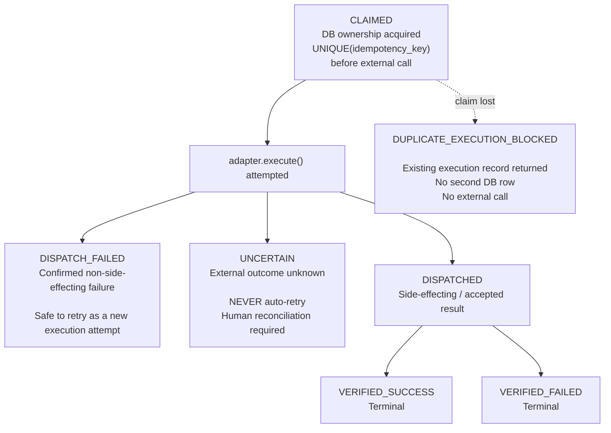

# Execution State Machine — Phase 5

## State Semantics

| State | Meaning | Automatic retry? |
|---|---|---|
| `CLAIMED` | Internal ownership acquired; external dispatch has not yet been confirmed | Only after reconciliation establishes safe pre-dispatch state |
| `DISPATCH_FAILED` | Failure confirmed before any external side effect | Yes, as a new execution attempt |
| `UNCERTAIN` | External outcome cannot be established | **Never** |
| `DISPATCHED` | External dispatch returned a side-effecting/accepted result | No retry; proceed to verification |
| `VERIFIED_SUCCESS` | External action confirmed successful | Terminal |
| `VERIFIED_FAILED` | External action confirmed failed | Terminal |
| `DUPLICATE_EXECUTION_BLOCKED` | Another process already owns the idempotency key | No second claim or external call |

## The invariant that makes this safe

**Once a row is `CLAIMED`, no other process can ever claim the same
`idempotency_key` again** — enforced by a database `UNIQUE` constraint,
not application logic (see `execution/idempotency.py`). All state
transitions FROM `CLAIMED` onward are made exclusively by the process
that won the claim, using its own row's primary key, never by a second
`INSERT`.

## Crash safety — the scenario the spec calls out explicitly

**"Process claims execution, then crashes; external action may or may
not have happened."**

- If the crash is **provably before** `adapter.execute()` was called,
  no external action was attempted and the existing `CLAIMED` row can
  safely be reopened for another dispatch attempt. A reconciliation job can detect a
  `CLAIMED` row older than a configured staleness threshold with no
  `dispatched_at` timestamp and safely re-open it for a new dispatch
  attempt using the SAME row (not a new idempotency key — no external
  action to duplicate).
- If the crash happens **during or after** `adapter.execute()`, whether
  the external side effect actually occurred is **genuinely unknown**
  to this system unless the external system itself provides a
  reconciliation query (e.g., "did payment link X actually get
  created?"). This is why `UNCERTAIN` exists as its own state, distinct
  from a stale `CLAIMED` row: **the system must not pretend to know
  what it does not know, and must never auto-retry an `UNCERTAIN`
  financial action.** An `UNCERTAIN` row requires either (a) a manual
  reconciliation check against the external system's own records, or
  (b) explicit human sign-off to proceed.

These cases are intentionally different: a confirmed pre-side-effect
`DISPATCH_FAILED` represents a completed failed execution attempt and
therefore starts a new execution attempt with a new idempotency key,
whereas a stale `CLAIMED` row proven to have never reached the external
adapter can be safely reopened using the existing execution record.

This system does **not** claim exactly-once delivery to Razorpay's API.
It guarantees exactly-once **internal ownership** of each idempotency key
within the execution database, and provides honest, auditable uncertainty
when the external outcome cannot be confirmed — which is the maximum
honest guarantee an internal system can make without relying on the
external API's own idempotency semantics.

## Reconciliation is a deliberately separate, narrow operation

`execution/service.py` intentionally does NOT auto-resolve `UNCERTAIN`
or stale `CLAIMED` rows as part of normal request handling — that logic
lives in a distinct `reconcile_stale_claims()` function, called out of
band (e.g. a periodic job), so the request path itself stays simple and
auditable. Reconciliation determines whether a stale `CLAIMED` record is
eligible for reopening based on persisted evidence (such as the absence of
a `dispatched_at` timestamp, exceeding a configured staleness threshold,
and evidence that the external adapter call had not begun). Stale `CLAIMED`
rows are not assumed to be blindly safe without verifying these evidence conditions.
